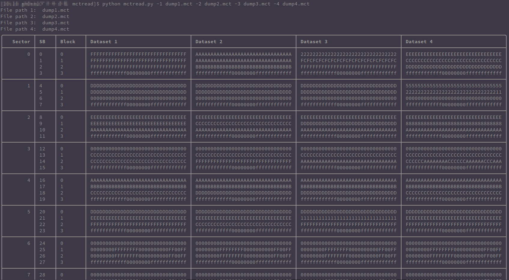

I needed a tool to compare Mifare Classic 1K dumps made with [MCT](https://github.com/ikarus23/MifareClassicTool) in a computer, there's this great [Mifare dump parser](https://github.com/zhovner/mfdread) but it only works with .mdf files and my workflow required only .mct files so using it as inspiration I created this.

### Features:
- Compare up to 4 different dumps at the same time

### TO-DO:
- Add a color parser to diff faster

### Screenshot:

